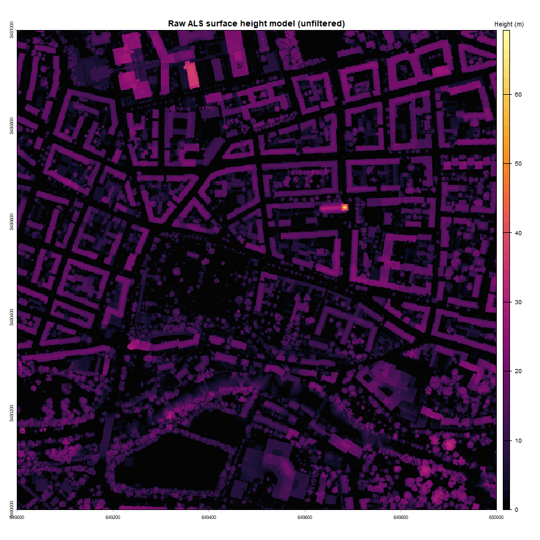
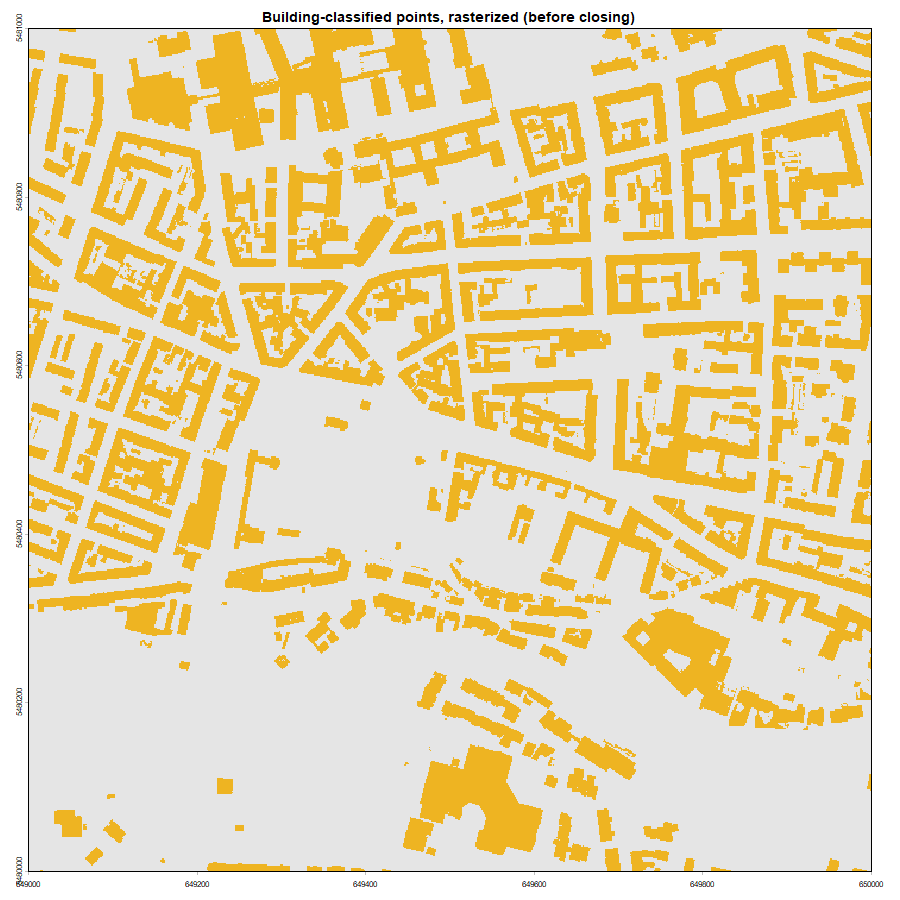
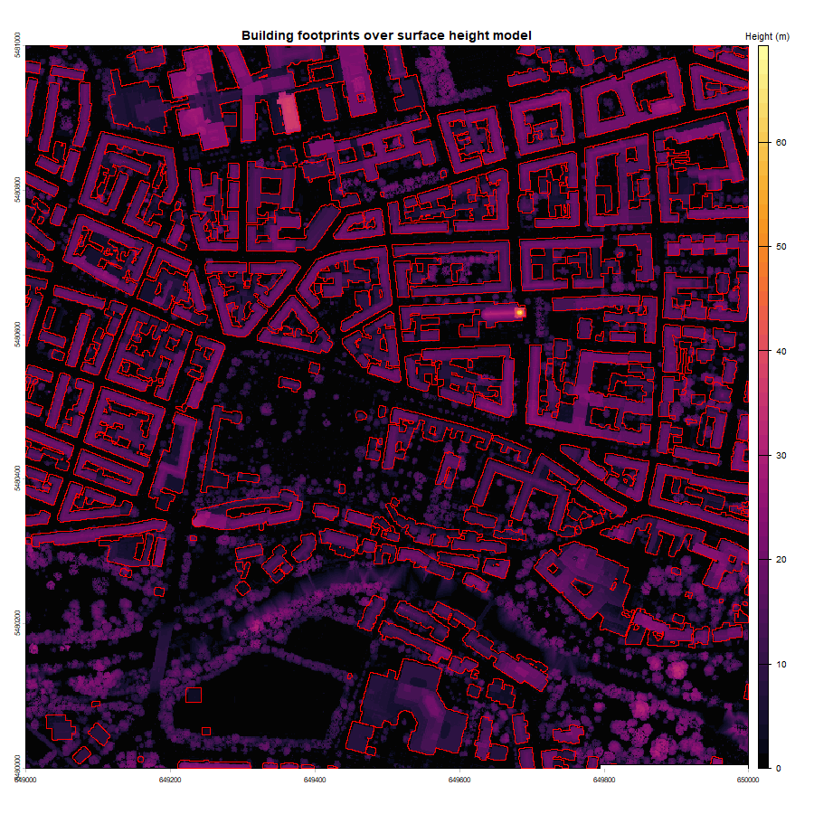
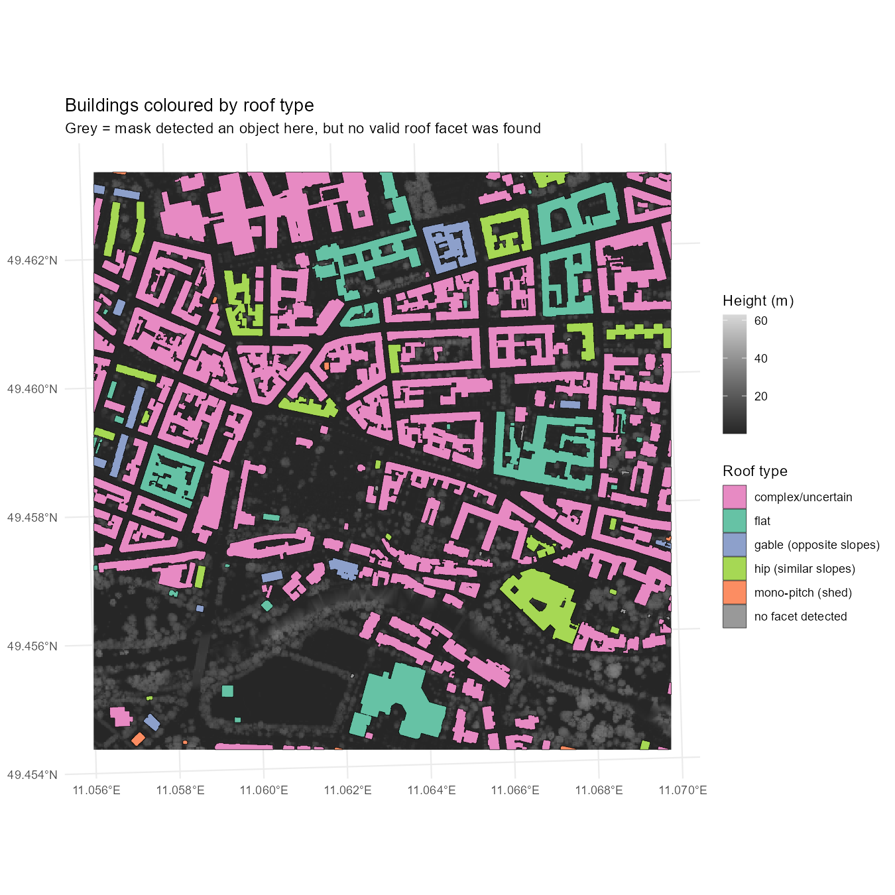
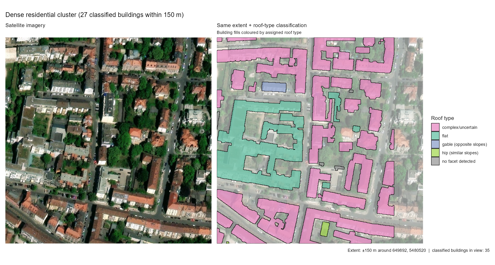
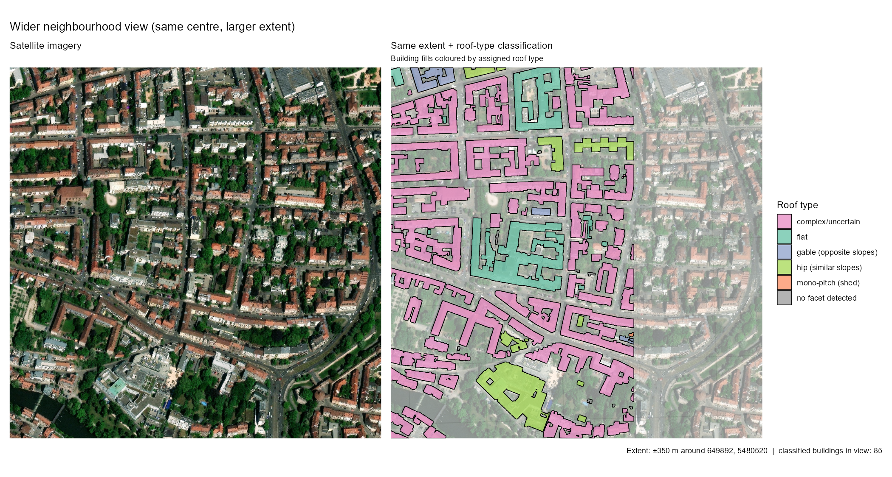
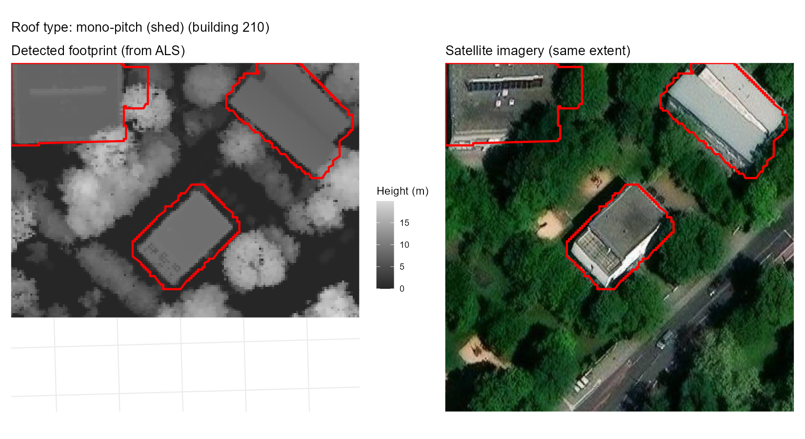
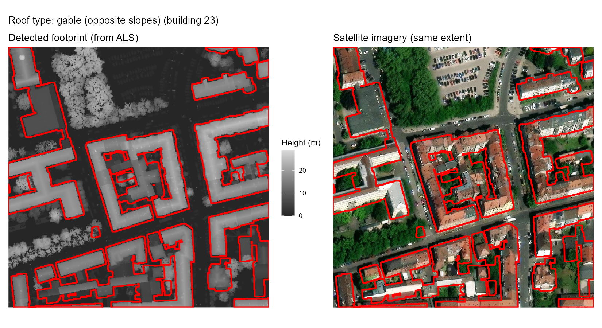
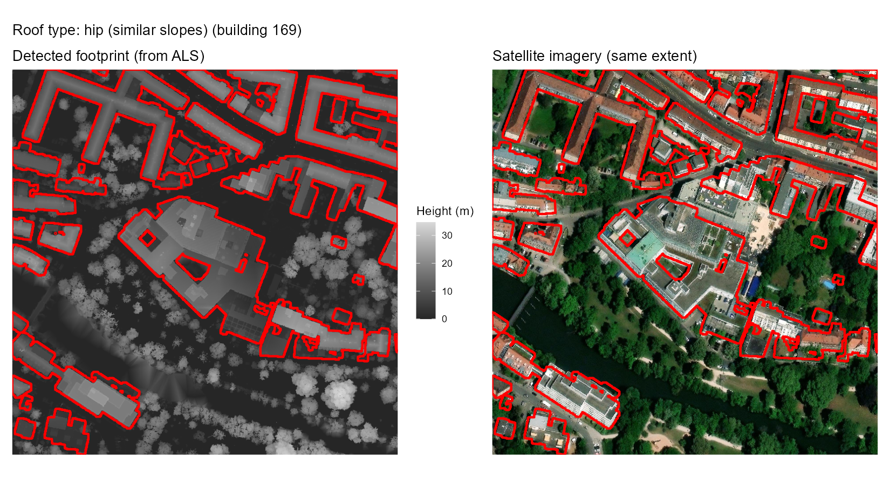
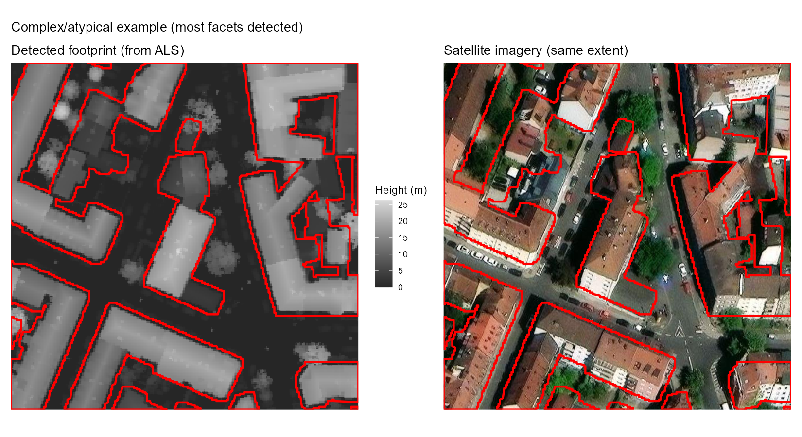

# Building Extraction and Roof Geometry from Urban ALS

## Project description 
This project investigates the extraction of building footprints and roof geometry from 
airborne laser scanning (ALS) point clouds in an urban area in Nuremberg, Germany. 

## Data

The project uses open geospatial data from the Bavarian State Office for
Digitisation and Surveying (LDBV), covering a 1 km × 1 km tile over the
city of Nuremberg, Bavaria, Germany. 

Two datasets are required:

- **ALS point cloud** — `649_5480.laz`, Airborne Laser Scanning (ALS) point
  cloud with ASPRS classification (class 6 = building).
- **Digital Terrain Model** — `649_5480_DGM1.tif`, 1 m resolution DTM for
  the same tile, used for height normalization.

The `.laz` and `.tif` files are not included in this repository due to
their size. They are freely available from the Bavaria open data portal:

https://geodaten.bayern.de/opengeodata/

To reproduce the results, download the tile `649_5480` (both the ALS point
cloud and the matching DGM1), place both files in a local folder, and
update the `las_path` and `dtm_path` variables at the top of `building_roof.R`.

## Code

The main workflow is implemented in R. The script covers:

ALS height normalization
Building footprint extraction
Roof-plane segmentation
Roof geometry estimation
Roof-type classification
Spatial and tabular output generation

Required R packages: `lidR`, `terra`, `sf`, `dplyr`, `purrr`, `tidyr`,
`ggplot2`, `ggnewscale`, `maptiles`, `tidyterra`, `patchwork`.
These are installed automatically on first run if missing.

### Methods

The workflow was designed to extract buildings from the ALS point cloud and derive basic roof geometry.

- Building extraction: Building-classified LiDAR points were used to generate building footprints and remove low-height objects.
- RANSAC (Random Sample Consensus) plane segmentation: RANSAC algorithm was used to identify planar surfaces within individual buildings,
with the aim of separating different roof facets.
- PCA-based geometry: PCA (Principal Component Analysis) was applied to the detected planes to derive their orientation and geometric properties,
including slope and aspect.
- Roof-type classification: Roof facets were then analysed based on their slope, aspect, number, and spatial relationships to classify
buildings into basic roof types such as flat, mono-pitch, gable, hip, and complex. Roof-type classification uses a small rule set based
on conventions (flat < 7°; gable = two adjacent facets with similar slopes and opposite aspects; hip = 3–4 adjacent facets with
similar slopes). The tolerance thresholds are empirical values tuned to this dataset; they are defined as parameters at the top of the script and
can be adjusted for other tiles.

## Results

### Building footprint extraction

Building footprints were extracted from ASPRS class-6 points and refined using 
two height-based filters introduced during calibration::

- A footprint p75-height filter (footprint_p75_min = 3.0 m), which rejects low-height
objects that were occasionally included in the class-6 mask, such as terraces, patios, and driveways.

- A roof minimum height (roof_min_height = 2.5 m), which removes low façade and ground-level
points before roof-plane detection.

The figures below show the input surface model, the rasterized building
mask, and the final extracted footprints over the tile:

After calibration, the extracted footprints generally matched the building outlines 
visible in satellite imagery, and the previously observed inclusion of adjacent 
low objects was substantially reduced.

### Roof-type classification

Classification of roof geometry proved more challenging than footprint
extraction. The results show that the model distinguishes the main 
roof categories (flat, mono-pitch, gable, hip).

At the scale of individual buildings, however, the distinction is less
reliable. The results show a few recurring problems:

- A building that is clearly a gable or hip in satellite imagery is
usually classified as complex/uncertain, usually because RANSAC split one
real roof plane into two adjacent facets.

- Two adjacent small buildings that share a wall are merged into a single
footprint, producing a facet pattern that matches neither building.

- Dormers, chimneys, and roof-mounted equipment generate small facets
that are either merged into the main plane or discarded, depending on
the min_facet_area_m2 threshold.

The zoom comparisons below illustrate these issues directly: raw
satellite imagery on the left, the same extent with footprints coloured
by roof type on the right.

## Examples

The following examples illustrate different roof geometries identified in the study area.

**Gable (opposite slopes)**

**Hip (similar slopes)**

**Complex case** — the footprint with the most detected facets:

## Limitations
Three limitations are worth noting:

- Point density: Facet segmentation is sensitive to point density. Sparse areas,
particularly around building edges and small roof structures, may not contain
enough points for reliable RANSAC plane fitting.

- Empirical thresholds: The slope, aspect, adjacency, and facet-size thresholds
used for roof classification were manually tuned for this tile. Their performance
may therefore vary for other areas or datasets.

- Complex roof structures: Buildings with multiple roof sections, dormers,
chimneys, or closely connected structures are more difficult to classify
reliably using the current rule-based approach.

## Author
Jaqueline Lopes Polvani

Msc Student - Applied Earth Observation and Geoanalysis

University of Würzburg
